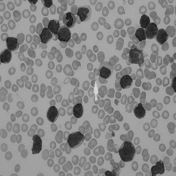
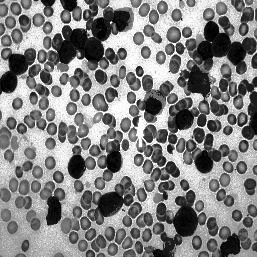
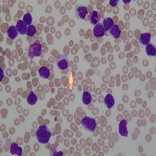

# AML Python Classifier Data Augmentation


The AML (Acute Myeloid Leukemia) Python Classifier is part of the computer vision research and development for the Peter Moss Acute Myeloid Leukemia Research Project. This part of the project is a Convolutional Neural Network(CNN) for classifying Acute Myeloid Leukemia positive and negative cells in images of blood samples. This version is a pure Python network written with minimal 3rd party libraries.

# Research papers followed

The papers that this part of the project is based on were provided by project team member, Ho Leung, Associate Professor of Biochemistry & Molecular Biophysics at Kansas State University. 

## Leukemia Blood Cell Image Classification Using Convolutional Neural Network
T. T. P. Thanh, Caleb Vununu, Sukhrob Atoev, Suk-Hwan Lee, and Ki-Ryong Kwon 
http://www.ijcte.org/vol10/1198-H0012.pdf

# Dataset  

The [Acute Lymphoblastic Leukemia Image Database for Image Processing](https://homes.di.unimi.it/scotti/all/) dataset is used for this project. The dataset was created by [Fabio Scotti, Associate Professor Dipartimento di Informatica, Università degli Studi di Milano](https://homes.di.unimi.it/scotti/). Big thanks to Fabio for his research and time put in to creating the dataset and documentation, it is one of his personal projects. You will need to follow the steps outlined [here](https://homes.di.unimi.it/scotti/all/#download) to gain access to the dataset.

## Data augmentation





<div style="clear:both;">

I decided to use some augmentation proposals outlined in Leukemia Blood Cell Image Classification Using Convolutional Neural Network by T. T. P. Thanh, Caleb Vununu, Sukhrob Atoev, Suk-Hwan Lee, and Ki-Ryong Kwon. The augmentations I chose were grayscaling, histogram equalization, horizontal and vertical reflection and gaussian blur. Using these techniques so far I have been able to increase a dataset from 49 positive and 49 negative images to 270 positive and 270 negative, with more augmentations to experiment with. 

The full Python class that holds the functions mentioned below can be found in [Classes/Data.py](Classes/Data.py), Data.py is a wrapper class around popular libraries including as OpenCV and .

### Grayscaling

Grayscaled images are not as complex as color images and result in a less complex model. To convert the image to greyscale I wrapped the built in OpenCV function, [cv2.cvtColor()](https://opencv-python-tutroals.readthedocs.io/en/latest/py_tutorials/py_imgproc/py_colorspaces/py_colorspaces.html). The created images will be saved to the relevant directories in the default configuration. 

```
def grayScale(self, image, filePath, filename, show = False):
        
    ###############################################################
    #
    # Creates a grayscale copy of the passed image.
    #
    ###############################################################
        
    print(filePath)
    image = cv2.resize(image, self.fixed)
    gray = cv2.cvtColor(image, cv2.COLOR_BGR2GRAY)
    self.writeImage(filePath, gray)
    if show is True:
        plt.imshow(gray)
        plt.show()
    return image, gray
```

### Histogram Equalization

<a href="https://opencv-python-tutroals.readthedocs.io/en/latest/py_tutorials/py_imgproc/py_histograms/py_histogram_equalization/py_histogram_equalization.html"></a>
<div style="clear:both;"></div>
<i>Image: <a href="https://opencv-python-tutroals.readthedocs.io/en/latest/py_tutorials/py_imgproc/py_histograms/py_histogram_equalization/py_histogram_equalization.html">OpenCV/Wikipedia</a></i>

Histogram equalization is basically as shown in the image above. The histogram on the left represents a bright image and the histogram on the right represents the same image but with histogram equalization applied. Basically the histogram is stretched on both sides, increasing the intensity/contrast. 

In the case of this dataset, it makes both the white and red blood cells more distinguishable. The created images will be saved to the relevant directories in the default configuration. 

```
def equalizeHist(self, gray, histPath, filename, show = False):
        
    ###############################################################
    #
    # Creates a grayscale copy of the passed image.
    #
    ###############################################################

    print(histPath)
    hist = cv2.equalizeHist(gray)
    self.writeImage(histPath, cv2.equalizeHist(gray))
    if show is True:
        plt.imshow(hist)
        plt.show()
    return hist
```

### Reflection

Reflection is a way of increasing your dataset by creating a copy that is fliped on its X axis, and a copy that is flipped on its Y axis. The reflection function below uses the built in OpenCV function, cv2.flip, to flip the image on the mentioned axis.  The created images will be saved to the relevant directories in the default configuration. 

```
def reflection(self, image, horPath, verPath, show = False):
        
    ###############################################################
    #
    # Creates two copies of the passed image using reflection on 
    # the x & y axis. 
    #
    ###############################################################
    
    print(horPath)
    horImg = cv2.flip(image, 0)
    self.writeImage(horPath, horImg)
    if show is True:
        plt.imshow(horImg)
        plt.show()
    print(verPath)
    verImg = cv2.flip( image, 1 )
    self.writeImage(verPath, verImg)
    if show is True:
        plt.imshow(verImg)
        plt.show()
    return horImg, verImg
```

### Gaussian Blur

Gaussian Blur is a popular technique used on images and is especially popular in the computer vision world. The function below uses the ndimage.gaussian_filter function. The created images will be saved to the relevant directories in the default configuration. 

```
def gaussian(self, filePath, gaussianPath, show = False):
    print(gaussianPath)
    gaussianBlur = ndimage.gaussian_filter(plt.imread(filePath), sigma=5.11)
    self.writeImage(gaussianPath, gaussianBlur)
    if show is True:
        plt.imshow(gaussianBlur)
        plt.show()
    return gaussianBlur	
```

# Clone the code from the Github repo

You will need to clone the project from our Github to which ever device you are going to run it on. 

# Dataset Access

The [Acute Lymphoblastic Leukemia Image Database for Image Processing](https://homes.di.unimi.it/scotti/all/) by [Fabio Scotti, Associate Professor Dipartimento di Informatica, Università degli Studi di Milano](https://homes.di.unimi.it/scotti/) is used with this project, you can request access by following the unstructions on the [Download and Term of use](https://homes.di.unimi.it/scotti/all/#download) page, you can also view [Reporting the results on ALL-IDB](https://homes.di.unimi.it/scotti/all/results.php) for information on how to organize and submit your findings.

Once you have access to the dataset, you should add your dataset to the 0 & 1 directories in the Model/Data directory, if you configure the same way you do not need to change any settings. I used 45 images from each folder resulting in a training / testing set of 90 images before data augmentation.

# The DataAugmentation Notebook

In the core of the project you will find a Juypter Notebook named __DataAugmentation.ipynb__. This Notebook seems to not run well on Github, but if you have cloned the repo you should be able to launch the Notebook fine. 

You will find and interactive tutorial in DataAugmentation.ipynb

# Contributing
Please read [CONTRIBUTING.md](https://github.com/AMLResearchProject/ComputerVision/blob/master/CONTRIBUTING.md "CONTRIBUTING.md") for details on our code of conduct, and the process for submitting pull requests to us.

# Versioning
We use SemVer for versioning. For the versions available, see [GeniSysAI/Vision/releases](https://github.com/AMLResearchProject/ComputerVision/releases "GeniSysAI/Vision/releases").

# License
This project is licensed under the **MIT License** - see the [LICENSE](https://github.com/AMLResearchProject/ComputerVision/blob/master/LICENSE "LICENSE") file for details.

# Bugs/Issues
We use the [repo issues](https://github.com/AMLResearchProject/ComputerVision/issues "repo issues") to track bugs and general requests related to using this project. 

# Author
Adam is a [BigFinite](https://www.bigfinite.com "BigFinite") IoT Network Engneer, part of the team that works on the core IoT software for our platform. In his spare time he is an [Intel Software Innovator](https://software.intel.com/en-us/intel-software-innovators/overview "Intel Software Innovator") in the fields of Internet of Things, Artificial Intelligence and Virtual Reality.

[](https://github.com/AdamMiltonBarker)