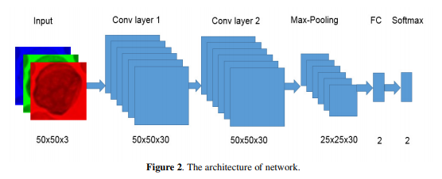

# Peter Moss Acute Myeloid & Lymphoblastic Leukemia AI Research Project
## Acute Lymphoblastic Leukemia Classifiers 2019
### Keras Classifiers
#### AllCNN Classifiers
##### AllCNN Classifier (Paper 1/Dataset 2/Non Augmented)


&nbsp;

# Table Of Contents

- [Introduction](#introduction)
- [DISCLAIMER](#disclaimer)
- [Model Architecture](#model-architecture)
  - [Proposed Architecture](#proposed-architecture)
- [Proposed Training / Validation Sets](#proposed-training-validation-sets)
- [Clone Repository](#clone-repository)
- [Upload Project Root To Google Drive](#upload-project-root-to-google-drive)
- [Results on ALL-IDB (Images)](#results-on-all-idb-images)
  - [Training Results](#training-results)
  - [Overall Results](#overall-results)
- [Contributing](#contributing)
    - [Contributors](#contributors)
- [Versioning](#versioning)
- [License](#license)
- [Bugs/Issues](#bugs-issues)

&nbsp;

# Introduction
The AllCNN Classifier Paper 1/Dataset 2/Non Augmented Classifier uses the [ACUTE LEUKEMIA CLASSIFICATION USING CONVOLUTION NEURAL NETWORK IN CLINICAL DECISION SUPPORT SYSTEM](https://airccj.org/CSCP/vol7/csit77505.pdf "ACUTE LEUKEMIA CLASSIFICATION USING CONVOLUTION NEURAL NETWORK IN CLINICAL DECISION SUPPORT SYSTEM") paper and the original (non augmented) [ALL_IDB2](https://homes.di.unimi.it/scotti/all/#datasets "ALL_IDB2") dataset.

&nbsp;

# DISCLAIMER
This project should be used for research purposes only. The purpose of the project is to show the potential of Artificial Intelligence for medical support systems such as diagnosis systems.

Although the classifier is accurate and show good results both on paper and in real world testing, they are not meant to be an alternative to professional medical diagnosis.

Developers that have contributed to this repository have experience in using Artificial Intelligence for detecting certain types of cancer. They are not a doctors, medical or cancer experts.

Please use these systems responsibly.

&nbsp;

# Model Architecture


_Fig 1. Proposed Architecture ([Source](https://airccj.org/CSCP/vol7/csit77505.pdf "Source"))_

## Proposed Architecture

In the [ACUTE LEUKEMIA CLASSIFICATION USING CONVOLUTION NEURAL NETWORK IN CLINICAL DECISION SUPPORT SYSTEM](https://airccj.org/CSCP/vol7/csit77505.pdf "ACUTE LEUKEMIA CLASSIFICATION USING CONVOLUTION NEURAL NETWORK IN CLINICAL DECISION SUPPORT SYSTEM") paper the authors explain the layers they used to create their convolutional neural network.

> "In this work, we proposed a network contains 4 layers. The first 3 layers for detecting features
> and the other two layers (Fully connected and Softmax) are for classifying the features. The input
> image has the size [50x50x3]. The receptive field (or the filter size) is 5x5. The stride is 1 then we move the filters one pixel at a time. The zero-padding is 2. It will allow us to control the spatial
> size of the output image (we will use it to exactly preserve the spatial size of the input volume so
> the input and output width and height are the same). During the experiment, we found that in our
> case, altering the size of original image during the convolution lead to decrease the accuracy
> about 40%. Thus the output image after convolution layer 1 has the same size with the input
> image."

> "The convolution layer 2 has the same structure with the convolution layer 1. The filter size is 5x5,
> the stride is 1 and the zero-padding is 2. The number of feature maps (the channel or the depth) in
> our case is 30. If the number of feature maps is lower or higher than 30, the accuracy will
> decrease 50%. By experiment, we found the accuracy also decrease 50% if we remove
> Convolution layer 2.""

> "The Max-Pooling layer 25x25 has Filter size is 2 and stride is 2. The fully connected layer has 2
> neural. Finally, we use the Softmax layer for the classification. "

## Proposed Training / Validation Sets

In the paper the authors use the **ALL_IDB1** dataset. The paper proposes the following training and validation sets proposed in the paper, where **Normal cell** refers to ALL negative examples and **Abnormal cell** refers to ALL positive examples.

|               | Training Set | Test Set |
| ------------- | ------------ | -------- |
| Normal cell   | 40           | 19       |
| Abnormal cell | 40           | 9        |
| **Total**     | **80**       | **28**   |

You can view the notebook using **ALL_IDB1** here. In this notebook however, you are going to use the **ALL_IDB2** dataset. On [Fabio Scotti's ALL-IDB website](https://homes.di.unimi.it/scotti/all), Fabio provides a [guideline for reporting your results when using ALL-IDB](https://homes.di.unimi.it/scotti/all/results.php). In this guideline a benchmark is proposed, this benchmark includes testing with both **ALL_IDB1** & **ALL_IDB2**:

> "A system capable to identify the presence of blast cells in the input image can work with different structures of modules, for example, it can processes the following steps: (i) the identification of white cells in the image, (ii) the selection of Lymphocytes, (iii) the classification of tumor cell. Each single step typically contains segmentation/ classification algorithms. In order to measure and fairly compare the identification accuracy of different structures of modules, we propose a benchmark approach partitioned in three different tests, as follows:"

- Cell test - the benchmark account for the classification of single cells is blast or not (the test is positive if the considered cell is blast cell or not);
- Image level - the whole image is classified (the test is positive if the considered image contains at least one blast cell or not).

In the paper the authors do not cover using **ALL_IDB2**. As ALL_IDB2 has an equal amount of images in each class (130 per class) you will use the entire ALL_IDB2 dataset with a test split of 20%.

&nbsp;

# Clone Repository

First of all you should clone the [ALL Classifiers 2019](https://github.com/AMLResearchProject/ALL-Classifiers-2019/ "ALL Classifiers 2019") repo to your device. To do this you can navigate to the location you want to clone the repository to on your device using terminal (cd Your/Clone/Location), and then use the following command:

```
  $ git clone https://github.com/AMLResearchProject/ALL-Classifiers-2019.git
```

Once you have used the command above you will see a directory called **ALL-Classifiers-2019** in the location you chose to clone the repo to. In terminal, navigate to the **ALL-Classifiers-2019/Python/\_Keras/AllCNN/Paper_1/ALL_IDB2/Non_Augmented/** directory, this is your project root directory.

&nbsp;

# Upload Project Root To Google Drive

Now you need to upload the project root to your Google Drive, placing the tif files from the ALL_IDB2 dataset in the **Model/Data/Training/** directory. Once you have done this open **AllCNN.ipynb** in Google Colab and continue from the **Google Drive / Colab** section to complete the project.

&nbsp;

# Results on ALL-IDB (Images)

In the paper the authors got 96.43% using a Matlab classifier, however their results were from a different dataset. This network on the ALL_IDB2 dataset got around 96% accuracy.

## Training Results

Below are the training results for 100 epochs.

| Loss          | Accuracy     | Precision     | Recall        | AUC          |
| ------------- | ------------ | ------------- | ------------- | ------------ |
| 0.083 (~0.84) | 0.961 (~96%) | 0.961 (~0.96) | 0.961 (~0.96) | 0.997 (~1.0) |

## Overall Results

| Figures of merit     | Value | Percentage |
| -------------------- | ----- | ---------- |
| True Positives       | 1     | 1.92%      |
| False Positives      | 25    | 48.08%     |
| True Negatives       | 25    | 48.08%     |
| False Negatives      | 1     | 1.92%      |
| Misclassification    | 26    | 50.00%     |
| Sensitivity / Recall | 0.96  | 96%        |
| Specificity          | 0.5   | 50%        |

&nbsp;

# Contributing

The Peter Moss Acute Myeloid & Lymphoblastic Leukemia AI Research project encourages and welcomes code contributions, bug fixes and enhancements from the Github.

Please read the [CONTRIBUTING](../../../../../../CONTRIBUTING.md "CONTRIBUTING") document for a full guide to forking our repositories and submitting your pull requests. You will also find information about our code of conduct on this page.

## Contributors

- [Adam Milton-Barker](https://www.leukemiaresearchassociation.ai/team/adam-milton-barker "Adam Milton-Barker") - [Asociacion De Investigation En Inteligencia Artificial Para La Leucemia Peter Moss](https://www.leukemiaresearchassociation.ai "Asociacion De Investigation En Inteligencia Artificial Para La Leucemia Peter Moss") President & Lead Developer, Sabadell, Spain

&nbsp;

# Versioning

We use SemVer for versioning. For the versions available.

&nbsp;

# License

This project is licensed under the **MIT License** - see the [LICENSE](../../../../../../LICENSE "LICENSE") file for details.

&nbsp;

# Bugs/Issues

We use the [repo issues](../../../../../../issues "repo issues") to track bugs and general requests related to using this project.
