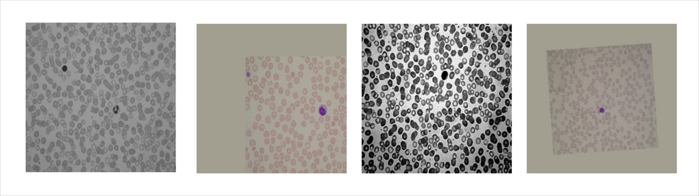
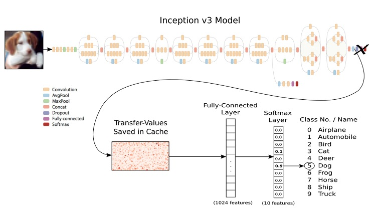
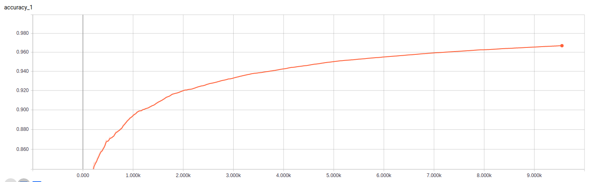
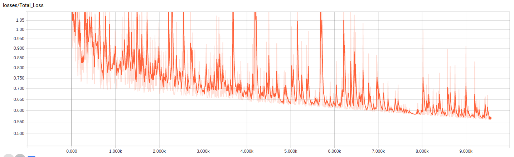
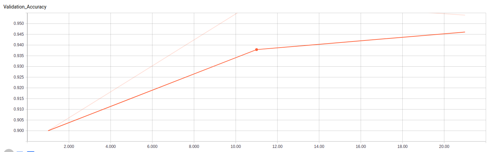
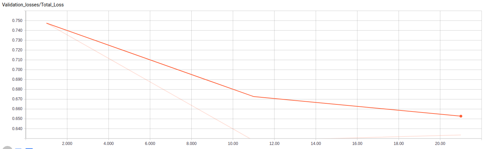

# Peter Moss Acute Myeloid & Lymphoblastic Leukemia AI Research Project
## Acute Lymphoblastic Leukemia Classifiers 2019
### NCS1 Classifier


&nbsp;

# Table Of Contents

- [Introduction](#introduction)
- [DISCLAIMER](#disclaimer)
- [Acute Myeloid Leukemia (AML)](#acute-myeloid-leukemia-aml)
- [Acute Lymphoblastic Leukemia (ALL)](#acute-myeloid-leukemia-aml)
- [Acute Lymphoblastic Leukemia Image Database for Image Processing (ALL-IDB)](#acute-lymphoblastic-leukemia-image-database-for-image-processing-all-idb)
- [Convolutional Neural Networks](#convolutional-neural-networks)
- [Transfer Learning](#transfer-learning)
- [System Requirements](#system-requirements)
- [Hardware Requirements](#hardware-requirements)
- [Software Requirements](#software-requirements)
- [Gain Access To ALL-IDB](#gain-access-to-all-idb)
- [Data Augmentation](#data-augmentation)
- [Installation](#installation)
  - [UFW Firewall](#ufw-firewall)
  - [Clone the repository](#clone-the-repository)
      - [Developer Forks](#developer-forks)
  - [Install Dependencies](#install-dependencies)
- [Adjusting Your Configuration](#adjusting-your-configuration)
- [Training On CPU/NVIDIA GPU](#training-on-cpunvidia-gpu)
  - [Prepare Your Data For Training](#prepare-your-data-for-training)
  - [Training Your Model](#training-your-model)
  - [Validate Your Model](#validate-your-model)
- [Tensorboard](#tensorboard)
  - [Tensorboard Training Graphs](#tensorboard-training-graphs)
  - [Tensorboard Validation Graphs](#tensorboard-validation-graphs)
- [Intel Movidius Neural Compute Stick 1](#intel-movidius-neural-compute-stick-1)
  - [Install Full NCSDK](#install-full-sdk)
  - [Install NCSDK API](#install-ncsdk-api)
  - [Converting Your Graph](#converting-your-graph)
- [Testing On Unseen Data](#testing-on-unseen-data)
- [Serving Your ALL Model](#serving-your-all-model)
- [Using the ALL Classifiers 2019 UI](#using-the-ALL-Classifiers-2019-ui)
- [Conclusion](#conclusion)
- [Contributing](#contributing)
    - [Contributors](#contributors)
- [Versioning](#versioning)
- [License](#license)
- [Bugs/Issues](#bugs-issues)

&nbsp;

# Introduction
The NCS1 Classifier is a CNN (Convolutional Neural Network) coded in Python using Tensorflow/TF Slim, Inception V3 and Transfer Learning. The classifier is part of the [Peter Moss Acute Myeloid & Lymphoblastic (AML & ALL) Leukemia AI Research Project](https://www.amlresearchproject.com) computer vision R&D with the focus of detection/early detection of AML & ALL.

This tutorial allows you to train a CNN locally on CPU/GPU or on Intel AI DevCloud. The classifier is trained on data provided in the [Acute Lymphoblastic Leukemia Image Database for Image Processing](https://homes.di.unimi.it/scotti/all/) that has been augmented to increase our data using the [AML & ALL Detection System Data Augmentation program](https://github.com/AMLResearchProject/AML-ALL-Detection-System/tree/master/Augmentation/V1 "AML & ALL Detection System Data Augmentation program"). 

The Tensorflow model is trained and then converted to a format compatible with the Movidius NCS1 by freezing the Tensorflow model and then running it through the NCSDK compiler. In this project I use an an UP Squared and the NCS1 for inference, but you can use any device that is running Ubuntu 16.04 or 18.04.

This classifier is an upgrade to the classifier previously built for the sister project, [Invasive Ductal Carcinoma Classifier](https://www.breastcancerai.com/).

&nbsp;

# DISCLAIMER
This project should be used for research purposes only. The purpose of the project is to show the potential of Artificial Intelligence for medical support systems such as diagnosis systems.

Although the classifier is accurate and shows good results both on paper and in real world testing, it is not meant to be an alternative to professional medical diagnosis.

Developers that have contributed to this repository have experience in using Artificial Intelligence for detecting certain types of cancer. They are not a doctors, medical or cancer experts.

Please use these systems responsibly.

&nbsp;

# Acute Myeloid Leukemia (AML)

Despite being one of the most common forms of Leukemia, Acute Myeloid Leukemia (AML) is a still a relatively rare form of Leukemia that is more common in adults, but does affect children also. AML is an aggressive Leukemia where white blood cells mutate, attack and replace healthy red blood cells, effectively killing them.

The American Cancer Society's [estimates for leukemia in the United States for 2019 are](https://www.cancer.org/cancer/acute-myeloid-leukemia/about/key-statistics.html "estimates for leukemia in the United States for 2019 are"):

- About 61,780 new cases of leukemia (all kinds) and 22,840 deaths from leukemia (all kinds)
- About 21,450 new cases of acute myeloid leukemia (AML). Most will be in adults.
- About 10,920 deaths from AML. Almost all will be in adults.

In comparison, according to the [American Cancer Society](https://www.cancer.org/cancer/acute-myeloid-leukemia/about/key-statistics.html "American Cancer Society") there are 180,000 women a year in the United States being diagnosed with Invasive Ductal Carcinoma (IDC), a type of breast cancer which forms in the breast duct and invades the areas surrounding it.

&nbsp;

# Acute Lymphoblastic Leukemia (ALL)

Acute Lymphoblastic Leukemia is found in children and causes abnormally excessive amount of white blood cells known as lymphocytes. This form of Leukemia is also known as Acute Lymphocytic Leukemia. In this project we use data for ALL as we have yet to discover a good computer vision dataset for AML.

The American Cancer Society’s [estimates for acute lymphocytic leukemia (ALL) in the United States for 2019 (including both children and adults) are](https://www.cancer.org/cancer/acute-lymphocytic-leukemia/about/key-statistics.html "estimates for acute lymphocytic leukemia (ALL) in the United States for 2019 (including both children and adults) are"):

- About 5,930 new cases of ALL (3,280 in males and 2,650 in females)
- About 1,500 deaths from ALL (850 in males and 650 in females)

&nbsp;

# Acute Lymphoblastic Leukemia Image Database for Image Processing (ALL-IDB)


_Samples of augmented data generated using the Acute Lymphoblastic Leukemia Image Database for Image Processing dataset and the [AML & ALL Detection System Data Augmentation program](https://github.com/AMLResearchProject/AML-ALL-Detection-System/tree/master/Augmentation/V1 "AML & ALL Detection System Data Augmentation program")._

The [Acute Lymphoblastic Leukemia Image Database for Image Processing](https://homes.di.unimi.it/scotti/all/) dataset is used for this project. The dataset was created by [Fabio Scotti, Associate Professor Dipartimento di Informatica, Università degli Studi di Milano](https://homes.di.unimi.it/scotti/). Big thanks to Fabio for his research and time put in to creating the dataset and documentation, it is one of his personal projects and without the dataset this project would not be possible.

&nbsp;

# Convolutional Neural Networks


_Inception v3 architecture_ ([Source](https://github.com/tensorflow/models/tree/master/research/inception)).

Convolutional neural networks are a type of deep learning neural network. These types of neural nets are widely used in computer vision and have pushed the capabilities of computer vision over the last few years, performing exceptionally better than older, more traditional neural networks; however, studies show that there are trade-offs related to training times and accuracy.

&nbsp;

# Transfer Learning

  
_Inception V3 Transfer Learning_ ([Source](https://github.com/Hvass-Labs/TensorFlow-Tutorials)).

Transfer learning allows you to retrain the final layer of an existing model, resulting in a significant decrease in not only training time, but also the size of the dataset required. One of the most famous models that can be used for transfer learning is the Inception V3 model. Inception V3 by Google is the 3rd version in a series of Deep Learning Convolutional Architectures. Inception V3 was trained using a dataset of 1,000 classes ([See the list of classes here](https://gist.github.com/yrevar/942d3a0ac09ec9e5eb3a "See the list of classes here")) from the original ImageNet dataset which was trained with over 1 million training images, the Tensorflow version has 1,001 classes which is due to an additional "background' class not used in the original ImageNet. Inception V3 was trained for the ImageNet Large Visual Recognition Challenge where it was a first runner up.

&nbsp;

# System Requirements

- Tested on Ubuntu 18.04 & 16.04
- [Python 3.6](https://www.python.org/download/releases/3.6/ "Python 3.6")
- Requires PIP3

&nbsp;

# Hardware Requirements


_UP Squared & Movidius NCS1._

- Training device with NVIDIA GPU or [Intel® AI DevCloud](https://software.intel.com/en-us/ai/devcloud "Intel® AI DevCloud")
- [UP2](https://up-shop.org/28-up-squared "UP2"), Raspberry Pi or other Linux device for testing
- [Intel Movidius Neural Compute Stick 1](https://software.intel.com/en-us/neural-compute-stick "Intel Movidius Neural Compute Stick 1")

&nbsp;

# Software Requirements

- [Tensorflow 1.4.0](https://www.tensorflow.org/install "Tensorflow 1.4.0")
- [Tensorflow Slim](https://github.com/tensorflow/tensorflow/tree/master/tensorflow/contrib/slim "Tensorflow Slim")
- [Intel® Movidius™ NCSDK](https://github.com/movidius/ncsdk "Intel® Movidius™ NCSDK")

Installed using Setup.sh, more information can be found later in the tutorial.

&nbsp;

# Gain Access To ALL-IDB

You you need to be granted access to use the Acute Lymphoblastic Leukemia Image Database for Image Processing dataset. You can find the application form and information about getting access to the dataset on [this page](https://homes.di.unimi.it/scotti/all/#download) as well as information on how to contribute back to the project [here](https://homes.di.unimi.it/scotti/all/results.php). If you are not able to obtain a copy of the dataset please feel free to try this tutorial on your own dataset, we would be very happy to find additional AML & ALL datasets.

&nbsp;

# Data Augmentation

Assuming you have received permission to use the Acute Lymphoblastic Leukemia Image Database for Image Processing, you should follow the [Data Augmentation Jupyter Notebook](https://github.com/AMLResearchProject/AML-ALL-Detection-System/tree/master/Augmentation/V1/Augmentation.ipynb "Data Augmentation Jupyter Notebook") or [Data Augmentation Using Python](https://github.com/AMLResearchProject/AML-ALL-Detection-System/tree/master/Augmentation/V1/Manual.py "Data Augmentation Using Python") ([Tutorial](https://github.com/AMLResearchProject/AML-ALL-Detection-System/tree/master/Augmentation/V1/ "Tutorial"))to generate a larger training and testing dataset. Follow the Notebook or README to apply various filters to the dataset.

Data augmentations included are as follows:

- Grayscaling
- Histogram equalization
- Horizontal and vertical reflection
- Rotation
- Translation
- Gaussian blur

In my case the exact testing data that I extracted before creating the augmentation data set is as follows:

- Im006_1.jpg
- Im020_1.jpg
- Im024_1.jpg
- Im026_1.jpg
- Im028_1.jpg
- Im031_1.jpg
- Im035_1.jpg
- Im041_1.jpg
- Im047_1.jpg
- Im053_1.jpg
- Im057_1.jpg
- Im060_1.jpg
- Im063_1.jpg
- Im069_1.jpg
- Im074_1.jpg
- Im088_1.jpg
- Im095_1.jpg
- Im099_1.jpg
- Im0101_1.jpg
- Im0106_1.jpg

It is important that your testing data is removed from your training data. The point is to ensure that when testing, you are using images that the network has never seen before.

&nbsp;

# Installation

Below is a guide on how to install the Acute Lymphoblastic Leukemia TF Slim Inception V3 NCS1 Classifier on your device, as mentioned above the program has been tested with Ubuntu 18.04 & 16.04, but may work on other versions of Linux and possibly Windows.

## UFW Firewall

UFW firewall is used to protect the ports of your device.

```
  sudo ufw status
```

```
  Status: inactive
```

If you are using this system on the same device as your GeniSysAI server, the local firewall has already been set up when you set up the server, all you need to do is open the ports that you decide to use for this project and add the port to the configuration file.

The ports are specified in **Required/confs.json**. The default port is set to **8080**. **FOR YOUR SECURITY YOU SHOULD CHANGE THESE!**.

To allow access to the ports use the following command for each of your ports:

```
  sudo ufw allow 8080
  sudo ufw status
```

```
 Status: active

 To                         Action      From
 --                         ------      ----
 22                         ALLOW       Anywhere
 8080                       ALLOW       Anywhere
 22 (v6)                    ALLOW       Anywhere (v6)
 8080 (v6)                  ALLOW       Anywhere (v6)
```

## Clone the repository

Clone the [ALL Classifiers 2019](https://github.com/AMLResearchProject/ALL-Classifiers-2019 "ALL Classifiers 2019") repository from the [Peter Moss Acute Myleoid & Lymphoblastic AI Research Project](https://github.com/AMLResearchProject "Peter Moss Acute Myleoid & Lymphoblastic AI Research Project") Github Organization.

To clone the repository and install the ALL Classifiers 2019, make sure you have Git installed. Now navigate to the home directory on your device using terminal/commandline, and then use the following command.

```
  git clone https://github.com/AMLResearchProject/ALL-Classifiers-2019.git
```

Once you have used the command above you will see a directory called **ALL-Classifiers-2019** in your home directory.

```
ls
```

Using the ls command in your home directory should show you the following.

```
ALL-Classifiers-2019
```

Navigate to **ALL-Classifiers-2019/NCS1** directory, this is your project root directory for this tutorial.

### Developer Forks

Developers from the Github community that would like to contribute to the development of this project should first create a fork, and clone that repository. For detailed information please view the [CONTRIBUTING](../CONTRIBUTING.md "CONTRIBUTING") guide. You should pull the latest code from the development branch.

```
  git clone -b "0.2.0" https://github.com/AMLResearchProject/ALL-Classifiers-2019.git
```

The **-b "0.2.0"** parameter ensures you get the code from the latest master branch. Before using the below command please check our latest master branch in the button at the top of the project README.

## Install Dependencies

```
  sed -i 's/\r//' setup.sh
  sh setup.sh
```

This file will install everything you need for the NCS1 Classifier.

&nbsp;

# Augment Your Data

Once you have everything installed if you have not yet done so you need to follow the [Data Augmentation Jupyter Notebook](../Augmentation/Augmentation.ipynb "Data Augmentation Jupyter Notebook") or [Data Augmentation Using Python](../Augmentation/Augmentation.py "Data Augmentation Using Python") ([Tutorial](../Augmentation/ "Tutorial")) to generate a larger training and testing dataset.

Once you have the augmented dataset you should have 1053 training images per class. You now need to move the augmented dataset to the [Model/Data](Model/Data/ "Model/Data") directory to your training device or AI DevCloud, and also move your testing data to the [Model/Test](Model/Test/ "Model/Test") directory on your testing device.

&nbsp;

# Adjusting Your Configuration

You can modify the configuration for your model using the configuration file in **Required/confs.json**. If you would like to try and replicate my results exactly, all you need to modify is the IP address that will be used by the API server.

```
{
  "Settings": {
    "Logs": "Logs/"
  },
  "Classifier": {
    "ALLGraph": "Model/ALLGraph.pb",
    "BatchSize": 10,
    "BatchTestSize": 30,
    "Classes": "Classes.txt",
    "DatasetDir": "Model/Data",
    "Domain": "",
    "Epochs": 65,
    "EpochsTest": 1,
    "EpochsDevCloud": 40,
    "EpochsBeforeDecay": 10,
    "FilePattern": "ALL_%s_*.tfrecord",
    "ImageSize": 299,
    "InceptionThreshold": 0.8,
    "InceptionGraph": "Model/ALL.graph",
    "IP": "",
    "Labels": "Labels.txt",
    "LearningRate": 0.0001,
    "LearningRateDecay": 0.8,
    "LogDir": "Model/_logs",
    "LogDirEval": "Model/_logs_eval",
    "Mean": 128,
    "NetworkPath": "",
    "NumClasses": 2,
    "OutputNode": "InceptionV3/Predictions/Softmax",
    "Port": 8080,
    "RandomSeed": 50,
    "Shards": 10,
    "TestImagePath": "Model/Test",
    "TFRecordFile": "ALL",
    "TFRecordPattern": "ALL_%s_*.tfrecord",
    "ValidationSize": 0.3,
    "ValidIType": [
      ".JPG",
      ".JPEG",
      ".PNG",
      ".GIF",
      ".jpg",
      ".jpeg",
      ".png",
      ".gif"
    ]
  }
}
```

&nbsp;

# Training On CPU/NVIDIA GPU

It is not recommended to train on CPU, although it should be possible it will take a long time and may max out resources. If you are training on your own device I would recommended that you use an NVIDIA GPU. You need to make sure you have Tensorflow/Tensprflow GPU 1.4.0 and related CUDA/CUDNN libraries installed before you can begin.

## Prepare Your Data For Training

The first thing you need to do is prepare your data ready to be used for training. Ensure you have moved your augmented data and testing data to the correct locations and then use the following command:

```
  python3 Data.py
```

## Training Your Model

Now it is time to train your model. To do so, you simply need to run the following command and wait for the program to finish, this will take some time so take a break from the computer.

```
  python3 Trainer.py
```

Once the program is finished you should see something similar to the below output:

```
INFO:tensorflow: Epch 65.95 Glb Stp 9549: Loss: 0.6573 (6.55 sec/step)
INFO:tensorflow: Epch 65.96 Glb Stp 9550: Loss: 0.5594 (6.70 sec/step)
INFO:tensorflow: Epch 65.97 Glb Stp 9551: Loss: 0.5554 (6.56 sec/step)
INFO:tensorflow: Epch 65.97 Glb Stp 9552: Loss: 0.5546 (6.55 sec/step)
INFO:tensorflow: Epch 65.98 Glb Stp 9553: Loss: 0.5559 (6.61 sec/step)
INFO:tensorflow: Epch 65.99 Glb Stp 9554: Loss: 0.5576 (6.68 sec/step)
INFO:tensorflow: Epch 65.99 Glb Stp 9555: Loss: 0.5544 (6.57 sec/step)
INFO:tensorflow:Final Loss: 0.55445
INFO:tensorflow:Final Accuracy: 0.96919936
INFO:tensorflow:Finished training! Saving model to disk now.
INFO:tensorflow:Restoring parameters from Model/_logs/model.ckpt-9508
Exporting graph...
INFO:tensorflow:Froze 378 variables.
Converted 378 variables to const ops.
2020-07-18 11:28:52,183 - Trainer - INFO - ALL Classifiers 2019 NCS1 Trainer ended in 65130.24632191658
```

You will see that our final training loss is **0.55445** and our final training accuracy is **0.96919936** so there is still room for improvement. You will find out how to see more info about the training process in the **Tensorboard** section below.

## Validate Your Model

Now we need to validate your model. To do this run the below code:

```
  python3 Evaluation.py
```

Once the program is finished you should see something similar to the below output although results may vary depending on your setup and data splits:

```
INFO:tensorflow:Global Step 17: Streaming Accuracy: 0.9167 (4.78 sec/step)
INFO:tensorflow:Global Step 18: Streaming Accuracy: 0.9157 (4.77 sec/step)
INFO:tensorflow:Global Step 19: Streaming Accuracy: 0.9167 (4.79 sec/step)
INFO:tensorflow:Global Step 20: Streaming Accuracy: 0.9158 (4.80 sec/step)
INFO:tensorflow:Global Step 21: Streaming Accuracy: 0.9167 (4.75 sec/step)
INFO:tensorflow:Final Streaming Accuracy: 0.9127
INFO:tensorflow:global_step/sec: 0.175
INFO:tensorflow:Model evaluation has completed! Visit TensorBoard for more information regarding your evaluation.
```

You will see that our final streaming accuracy is **0.9127** which is a little lower than the training accuracy shown above. We need to look more into what happened during training so we can see how to improve our model for version 2. To do this we can use Tensorboard, follow the instructions below.

&nbsp;

# Tensorboard

Tensorboard is a graphical interface that can give you more detailed information and specfics about what went on during your training and validation. During the training and validation stages, logs were written to **Model/\_logs** & **Model/\_logs_eval**. These logs can be used by Tensorboard to view more detailed information about your model. To run Tensorboard, navigate to the ** ** directory and use the following commands, you will be given a URL in the output which will allow you to access Tensorboard on your local network.

**Training Logs**

```
  tensorboard --logdir=Model/_logs --host "YourDeviceIP"
```

**Validation Logs**

```
  tensorboard --logdir=Model/_logs_eval --host "YourDeviceIP"
```

## Tensorboard Training Graphs

There are two main graphs we are interested in, Training_Accuracy & Training_losses/Total_Loss.


_CPU/GPU Training Accuracy._


_CPU/GPU Training Loss._

## Tensorboard Validation Graphs

There are two main graphs we are interested in, Valdation_Accuracy & Validation_losses/Total_Loss.


_CPU/GPU Validation Accuracy._


_CPU/GPU Validation Loss._

&nbsp;

# Intel Movidius Neural Compute Stick 1


In this project we use NCS1 to run classifications in near real time. If your testing device is an IoT development device such as an UP Squared or Raspberry Pi it is recommended that you install the full NCSDK on your training device and the NCSDK API on your testing device. You can of course simply use your training device for both training and testing, in which case you only need to follow the guide for installing the full SDK.

## Install Full NCSDK

The **NCSDK** needs to be installed on your training device, this will be used to convert the trained model into a format that is compatible with the Movidius NCS1. To install NCSDK use the following commands:

```
  mkdir -p ~/workspace && cd ~/workspace
  git clone https://github.com/movidius/ncsdk.git
  cd ~/workspace/ncsdk
  make install
```

If you want to play around with the examples, plug your Movidius into your device and issue the following commands:

```
  cd ~/workspace/ncsdk
  make examples
```

## Install NCSDK API

If you are using a smaller device for your testing device, you may need to install the NCSDK API which is a lot smaller than the full SDK but has some features that are not available such as compiling your graph. This will be used by the classifier to carry out inference on local images or images received via the API hosted on the GeniSysAI server you installed. Make sure you have the Movidius plugged in.

```
  mkdir -p ~/workspace && cd ~/workspace
  git clone https://github.com/movidius/ncsdk.git
  cd ~/workspace/ncsdk/api/src
  make
  sudo make install
```

## Converting Your Graph

Now we need to compile the frozen Tensorflow/TF Slim graph produced during training into a format that is compatible with the NCS1. To do this we need to ensure that the file **ALLGraph.pb** is in the **Model** directory and navigate to the ** ** directory in terminal. Once there you can execute the following commands to compile the graph:

```
  mvNCCompile  -s 12 Model/ALLGraph.pb -in=input -on=InceptionV3/Predictions/Softmax -o Model/ALL.graph
```

The above command will save ALL.graph to the **Model** directory.

&nbsp;

# Testing On Unseen Data

Now we will use [Classifier.py](Classifier.py " Classifier.py") with your test data. This classifier passes your test data through the NCS1 and predicts if Acute Lymphoblastic Leukemia is found in the images. You will see the output in console and you can also locate all AML & ALL Detection System logs in the [Logs](Logs " Logs") directory. To run the classifier, use the following command:

```
  python3 Classifier.py
```

This will run the classifier program using your test data. If you used the exact configuration and data splits you should see the following output although results may vary depending on your setup and data splits:

<details> 
  <summary>CPU/GPU Trained Results</summary>

```
2020-07-21 19:34:52,367 - Classifier - INFO - Helpers class initialization complete.
2020-07-21 19:34:52,368 - Movidius - INFO - Helpers class initialization complete.
2020-07-21 19:34:52,369 - Movidius - INFO - Movidius class initialization complete.
2020-07-21 19:34:52,891 - Movidius - INFO - Connected To NCS1 successfully.
2020-07-21 19:34:53,067 - Movidius - INFO - Movidius graph allocated successfully.
2020-07-21 19:34:53,113 - Movidius - INFO - Inception loaded successfully.
2020-07-21 19:34:53,117 - Classifier - INFO - Classifier class initialization complete.
2020-07-21 19:34:53,117 - Classifier - INFO - ALL Classifiers 2019 Classifier started.
2020-07-21 19:34:53,321 - Classifier - INFO - Loaded test image Model/Test/Im063_1.jpg
2020-07-21 19:34:53,712 - Classifier - INFO - ALL correctly detected with confidence of 0.999 in 0.3789231777191162 seconds.
2020-07-21 19:34:53,919 - Classifier - INFO - Loaded test image Model/Test/Im053_1.jpg
2020-07-21 19:34:54,262 - Classifier - INFO - ALL correctly detected with confidence of 0.999 in 0.3318161964416504 seconds.
2020-07-21 19:34:54,474 - Classifier - INFO - Loaded test image Model/Test/Im074_0.jpg
2020-07-21 19:34:54,816 - Classifier - INFO - ALL correctly not detected with confidence of 1.0 in 0.3312382698059082 seconds.
2020-07-21 19:34:55,023 - Classifier - INFO - Loaded test image Model/Test/Im088_0.jpg
2020-07-21 19:34:55,364 - Classifier - INFO - ALL correctly not detected with confidence of 1.0 in 0.33043575286865234 seconds.
2020-07-21 19:34:55,572 - Classifier - INFO - Loaded test image Model/Test/Im069_0.jpg
2020-07-21 19:34:55,915 - Classifier - INFO - ALL correctly not detected with confidence of 1.0 in 0.3317413330078125 seconds.
2020-07-21 19:34:56,124 - Classifier - INFO - Loaded test image Model/Test/Im106_0.jpg
2020-07-21 19:34:56,466 - Classifier - INFO - ALL correctly not detected with confidence of 1.0 in 0.3314836025238037 seconds.
2020-07-21 19:34:56,560 - Classifier - INFO - Loaded test image Model/Test/Im031_1.jpg
2020-07-21 19:34:56,900 - Classifier - WARNING - ALL incorrectly not detected with confidence of 0.8296 in 0.33110833168029785 seconds.
2020-07-21 19:34:57,099 - Classifier - INFO - Loaded test image Model/Test/Im101_0.jpg
2020-07-21 19:34:57,441 - Classifier - INFO - ALL correctly not detected with confidence of 1.0 in 0.33135080337524414 seconds.
2020-07-21 19:34:57,632 - Classifier - INFO - Loaded test image Model/Test/Im041_0.jpg
2020-07-21 19:34:57,975 - Classifier - INFO - ALL correctly not detected with confidence of 1.0 in 0.3327956199645996 seconds.
2020-07-21 19:34:58,052 - Classifier - INFO - Loaded test image Model/Test/Im024_1.jpg
2020-07-21 19:34:58,391 - Classifier - INFO - ALL correctly detected with confidence of 0.8833 in 0.33263349533081055 seconds.
2020-07-21 19:34:58,718 - Classifier - INFO - Loaded test image Model/Test/Im057_1.jpg
2020-07-21 19:34:59,060 - Classifier - INFO - ALL correctly detected with confidence of 0.999 in 0.3315732479095459 seconds.
2020-07-21 19:34:59,252 - Classifier - INFO - Loaded test image Model/Test/Im047_0.jpg
2020-07-21 19:34:59,594 - Classifier - INFO - ALL correctly not detected with confidence of 1.0 in 0.33240199089050293 seconds.
2020-07-21 19:34:59,782 - Classifier - INFO - Loaded test image Model/Test/Im060_1.jpg
2020-07-21 19:35:00,124 - Classifier - INFO - ALL correctly detected with confidence of 0.9883 in 0.3316988945007324 seconds.
2020-07-21 19:35:00,304 - Classifier - INFO - Loaded test image Model/Test/Im095_0.jpg
2020-07-21 19:35:00,646 - Classifier - INFO - ALL correctly not detected with confidence of 0.984 in 0.33166933059692383 seconds.
2020-07-21 19:35:00,836 - Classifier - INFO - Loaded test image Model/Test/Im035_0.jpg
2020-07-21 19:35:01,179 - Classifier - INFO - ALL correctly not detected with confidence of 1.0 in 0.331890344619751 seconds.
2020-07-21 19:35:01,251 - Classifier - INFO - Loaded test image Model/Test/Im006_1.jpg
2020-07-21 19:35:01,590 - Classifier - INFO - ALL correctly detected with confidence of 0.999 in 0.33198022842407227 seconds.
2020-07-21 19:35:01,782 - Classifier - INFO - Loaded test image Model/Test/Im099_0.jpg
2020-07-21 19:35:02,124 - Classifier - INFO - ALL correctly not detected with confidence of 1.0 in 0.3316376209259033 seconds.
2020-07-21 19:35:02,199 - Classifier - INFO - Loaded test image Model/Test/Im026_1.jpg
2020-07-21 19:35:02,536 - Classifier - INFO - ALL correctly detected with confidence of 0.994 in 0.3310544490814209 seconds.
2020-07-21 19:35:02,616 - Classifier - INFO - Loaded test image Model/Test/Im028_1.jpg
2020-07-21 19:35:02,954 - Classifier - WARNING - ALL incorrectly not detected with LOW confidence of 0.7217 in 0.3318631649017334 seconds.
2020-07-21 19:35:03,034 - Classifier - INFO - Loaded test image Model/Test/Im020_1.jpg
2020-07-21 19:35:03,373 - Classifier - WARNING - ALL incorrectly not detected with confidence of 0.957 in 0.3327059745788574 seconds.
2020-07-21 19:35:03,374 - Classifier - INFO - Testing ended. 17 correct, 3 incorrect, 1 low confidence: (0 correct, 1 incorrect)
```
</details>

&nbsp;

# Serving Your ALL Model

Now that we are all trained and tested, it is time to set up the server that will serve an **API endpoint** that provides access to your trained model via HTTP requests. The GeniSysAI UI will use this API to interact with the AI for training / classifying etc.

- **Server.py** starts a **Rest api server** with **API endpoints** for your **ALL** classifier.
- **Client.py** is provided to test sending images via HTTP to the API to receive a classification.

The server will run on the IP you specify in the configuration file. The server will use the following files/folders on your testing device.

```
Model/Data/Classes.txt
Model/Data/Labels.txt

Model/Test/

Model/ALL.graph

Required/confs.json

Client.py
Server.py
```

On your testing device, open up a terminal and navigate to the to the folder containing Server.py then issue the following command. This will start the server and wait to receive images for classification.

```
 python3 Server.py
```

You should see the following output:

```
2020-07-21 01:22:35,853 - Server - INFO - Helpers class initialization complete.
2020-07-21 01:22:35,855 - Movidius - INFO - Helpers class initialization complete.
2020-07-21 01:22:35,855 - Movidius - INFO - Movidius class initialization complete.
2020-07-21 01:22:36,340 - Movidius - INFO - Connected To NCS1 successfully.
2020-07-21 01:22:36,521 - Movidius - INFO - Movidius graph allocated successfully.
2020-07-21 01:22:36,523 - Movidius - INFO - Inception loaded successfully.
2020-07-21 01:22:36,530 - Server - INFO - Server class initialization complete.
 * Serving Flask app "Server" (lazy loading)
 * Environment: production
   WARNING: This is a development server. Do not use it in a production deployment.
   Use a production WSGI server instead.
 * Debug mode: off
 * Running on http://###.###.#.##:8080/ (Press CTRL+C to quit)
```

With your API server now running you can now start the client with the following command, you need to make sure your testing data is in the correct location:

```
 python3 Client.py Test
```

This will send the test data to the model API and return the predictions. You should see the following output:

```
2020-07-21 20:08:52,489 - Client - INFO - Helpers class initialization complete.
2020-07-21 20:08:52,489 - Client - INFO - Classifier class initialization complete.
2020-07-21 20:08:54,158 - Client - INFO - Model/Test/Im063_1.jpg: ALL detected with a confidence of 0.999 in 0.3803825378417969
2020-07-21 20:09:02,326 - Client - INFO - Model/Test/Im053_1.jpg: ALL detected with a confidence of 0.999 in 0.33513545989990234
2020-07-21 20:09:10,485 - Client - INFO - Model/Test/Im074_0.jpg: ALL not detected with a confidence of 1.0 in 0.33394408226013184
2020-07-21 20:09:18,651 - Client - INFO - Model/Test/Im088_0.jpg: ALL not detected with a confidence of 1.0 in 0.3346860408782959
2020-07-21 20:09:26,817 - Client - INFO - Model/Test/Im069_0.jpg: ALL not detected with a confidence of 1.0 in 0.3332250118255615
2020-07-21 20:09:34,982 - Client - INFO - Model/Test/Im106_0.jpg: ALL not detected with a confidence of 1.0 in 0.3344697952270508
2020-07-21 20:09:42,715 - Client - INFO - Model/Test/Im031_1.jpg: ALL not detected with a confidence of 0.8296 in 0.3336520195007324
2020-07-21 20:09:50,871 - Client - INFO - Model/Test/Im101_0.jpg: ALL not detected with a confidence of 1.0 in 0.33390378952026367
2020-07-21 20:09:59,021 - Client - INFO - Model/Test/Im041_0.jpg: ALL not detected with a confidence of 1.0 in 0.3335244655609131
2020-07-21 20:10:06,737 - Client - INFO - Model/Test/Im024_1.jpg: ALL detected with a confidence of 0.8833 in 0.3324394226074219
2020-07-21 20:10:14,882 - Client - INFO - Model/Test/Im057_1.jpg: ALL detected with a confidence of 0.999 in 0.3338301181793213
2020-07-21 20:10:23,039 - Client - INFO - Model/Test/Im047_0.jpg: ALL not detected with a confidence of 1.0 in 0.3329615592956543
2020-07-21 20:10:31,190 - Client - INFO - Model/Test/Im060_1.jpg: ALL detected with a confidence of 0.9883 in 0.33469510078430176
2020-07-21 20:10:39,295 - Client - INFO - Model/Test/Im095_0.jpg: ALL not detected with a confidence of 0.984 in 0.33468103408813477
2020-07-21 20:10:47,445 - Client - INFO - Model/Test/Im035_0.jpg: ALL not detected with a confidence of 1.0 in 0.335205078125
2020-07-21 20:10:55,160 - Client - INFO - Model/Test/Im006_1.jpg: ALL detected with a confidence of 0.999 in 0.33264636993408203
2020-07-21 20:11:03,302 - Client - INFO - Model/Test/Im099_0.jpg: ALL not detected with a confidence of 1.0 in 0.3349738121032715
2020-07-21 20:11:11,023 - Client - INFO - Model/Test/Im026_1.jpg: ALL detected with a confidence of 0.994 in 0.33417510986328125
2020-07-21 20:11:18,733 - Client - INFO - Model/Test/Im028_1.jpg: ALL not detected with a LOW confidence of 0.7217 in 0.3328828811645508
2020-07-21 20:11:26,440 - Client - INFO - Model/Test/Im020_1.jpg: ALL not detected with a confidence of 0.957 in 0.3333897590637207
```

&nbsp;

# Using the ALL Classifiers 2019 UI

The ALL Classifiers 2019 UI is an extension for the [GeniSysAI Server](https://github.com/GeniSysAI/Server "GeniSysAI Server"). You can find the full code for this UI in the [Acute Lymphoblastic Detection System 2019 Server](https://github.com/AMLResearchProject/ALL-Detection-System-2019/tree/master/Server "Acute Lymphoblastic Detection System 2019 Server") directory.

Once you have set up the server, you can use the UI to classify your test data. The system allows you to upload your test data and then send it to the server for classification, providing a visual classification tool. 

During testing I found that using the uploaded test data resulted in better classification resultsm whether using the UI or using the uploaded test data locally with the classifier. 

Using the untouched test data, the results were as follows: 

```
17 correct, 3 incorrect, 1 low confidence: (0 correct, 1 incorrect)
```
When uploading this test data to the classifier and testing using the local classifier or the http classifier, the results were as follows:

```
19 correct, 1 incorrect, 7 low confidence: (6 correct, 1 incorrect)
```

The upload script on the server uses PHP's **imagecreatefromjpeg**, **imagecrop** and **imagejpeg**, cropping the images to 600px x 600px. I attempted to replicate the PHP upload code in Python with both OpenCV and Pillow, but was not able to replicate the improvement in results. When I have some more time I will look into replicating the exact resize process in Python to see if we can improve the local results. 

The full results using the dataset cropped using PHP are as follows:

**Local Classifier**
```
2020-07-22 00:21:39,144 - Classifier - INFO - Loaded test image Model/Test/Im063_1.jpg
2020-07-22 00:21:39,531 - Classifier - INFO - ALL correctly detected with LOW confidence of 0.605 in 0.3793625831604004 seconds.
2020-07-22 00:21:39,552 - Classifier - INFO - Loaded test image Model/Test/Im053_1.jpg
2020-07-22 00:21:39,890 - Classifier - INFO - ALL correctly detected with confidence of 0.9893 in 0.3322145938873291 seconds.
2020-07-22 00:21:39,910 - Classifier - INFO - Loaded test image Model/Test/Im074_0.jpg
2020-07-22 00:21:40,247 - Classifier - INFO - ALL correctly not detected with confidence of 0.9507 in 0.3323228359222412 seconds.
2020-07-22 00:21:40,262 - Classifier - INFO - Loaded test image Model/Test/Im088_0.jpg
2020-07-22 00:21:40,600 - Classifier - INFO - ALL correctly not detected with confidence of 1.0 in 0.3331441879272461 seconds.
2020-07-22 00:21:40,619 - Classifier - INFO - Loaded test image Model/Test/Im069_0.jpg
2020-07-22 00:21:40,957 - Classifier - INFO - ALL correctly not detected with confidence of 0.997 in 0.33281946182250977 seconds.
2020-07-22 00:21:40,977 - Classifier - INFO - Loaded test image Model/Test/Im106_0.jpg
2020-07-22 00:21:41,314 - Classifier - INFO - ALL correctly not detected with confidence of 0.995 in 0.331695556640625 seconds.
2020-07-22 00:21:41,329 - Classifier - INFO - Loaded test image Model/Test/Im031_1.jpg
2020-07-22 00:21:41,667 - Classifier - INFO - ALL correctly detected with LOW confidence of 0.596 in 0.33196401596069336 seconds.
2020-07-22 00:21:41,678 - Classifier - INFO - Loaded test image Model/Test/Im101_0.jpg
2020-07-22 00:21:42,016 - Classifier - INFO - ALL correctly not detected with confidence of 0.995 in 0.3321669101715088 seconds.
2020-07-22 00:21:42,035 - Classifier - INFO - Loaded test image Model/Test/Im041_0.jpg
2020-07-22 00:21:42,373 - Classifier - INFO - ALL correctly not detected with confidence of 0.998 in 0.3324606418609619 seconds.
2020-07-22 00:21:42,393 - Classifier - INFO - Loaded test image Model/Test/Im024_1.jpg
2020-07-22 00:21:42,730 - Classifier - INFO - ALL correctly detected with LOW confidence of 0.51 in 0.3314645290374756 seconds.
2020-07-22 00:21:42,745 - Classifier - INFO - Loaded test image Model/Test/Im057_1.jpg
2020-07-22 00:21:43,083 - Classifier - INFO - ALL correctly detected with confidence of 0.935 in 0.3325080871582031 seconds.
2020-07-22 00:21:43,228 - Classifier - INFO - Loaded test image Model/Test/Im047_0.jpg
2020-07-22 00:21:43,565 - Classifier - INFO - ALL correctly not detected with confidence of 1.0 in 0.33155250549316406 seconds.
2020-07-22 00:21:43,582 - Classifier - INFO - Loaded test image Model/Test/Im060_1.jpg
2020-07-22 00:21:43,920 - Classifier - INFO - ALL correctly detected with LOW confidence of 0.5815 in 0.33184123039245605 seconds.
2020-07-22 00:21:43,933 - Classifier - INFO - Loaded test image Model/Test/Im095_0.jpg
2020-07-22 00:21:44,270 - Classifier - INFO - ALL correctly not detected with LOW confidence of 0.733 in 0.331646203994751 seconds.
2020-07-22 00:21:44,283 - Classifier - INFO - Loaded test image Model/Test/Im035_0.jpg
2020-07-22 00:21:44,621 - Classifier - INFO - ALL correctly not detected with confidence of 1.0 in 0.33235692977905273 seconds.
2020-07-22 00:21:44,638 - Classifier - INFO - Loaded test image Model/Test/Im006_1.jpg
2020-07-22 00:21:44,975 - Classifier - INFO - ALL correctly detected with confidence of 1.0 in 0.3319277763366699 seconds.
2020-07-22 00:21:44,989 - Classifier - INFO - Loaded test image Model/Test/Im099_0.jpg
2020-07-22 00:21:45,328 - Classifier - INFO - ALL correctly not detected with confidence of 1.0 in 0.33290529251098633 seconds.
2020-07-22 00:21:45,347 - Classifier - INFO - Loaded test image Model/Test/Im026_1.jpg
2020-07-22 00:21:45,684 - Classifier - INFO - ALL correctly detected with confidence of 0.981 in 0.3316617012023926 seconds.
2020-07-22 00:21:45,698 - Classifier - INFO - Loaded test image Model/Test/Im028_1.jpg
2020-07-22 00:21:46,035 - Classifier - WARNING - ALL incorrectly not detected with LOW confidence of 0.6772 in 0.3321866989135742 seconds.
2020-07-22 00:21:46,047 - Classifier - INFO - Loaded test image Model/Test/Im020_1.jpg
2020-07-22 00:21:46,384 - Classifier - INFO - ALL correctly detected with LOW confidence of 0.5405 in 0.33107590675354004 seconds.
2020-07-22 00:21:46,384 - Classifier - INFO - Testing ended. 19 correct, 1 incorrect, 7 low confidence: (6 correct, 1 incorrect)
```
**Server**
```
2020-07-22 00:18:02,152 - Client - INFO - Model/Test/Im063_1.jpg: ALL detected with a LOW confidence of 0.605 in 0.3804178237915039
2020-07-22 00:18:09,643 - Client - INFO - Model/Test/Im053_1.jpg: ALL detected with a confidence of 0.9893 in 0.404649019241333
2020-07-22 00:18:17,056 - Client - INFO - Model/Test/Im074_0.jpg: ALL not detected with a confidence of 0.9507 in 0.3337564468383789
2020-07-22 00:18:24,474 - Client - INFO - Model/Test/Im088_0.jpg: ALL not detected with a confidence of 1.0 in 0.3340914249420166
2020-07-22 00:18:31,889 - Client - INFO - Model/Test/Im069_0.jpg: ALL not detected with a confidence of 0.997 in 0.334122896194458
2020-07-22 00:18:39,306 - Client - INFO - Model/Test/Im106_0.jpg: ALL not detected with a confidence of 0.995 in 0.3339042663574219
2020-07-22 00:18:46,723 - Client - INFO - Model/Test/Im031_1.jpg: ALL detected with a LOW confidence of 0.596 in 0.332763671875
2020-07-22 00:18:54,138 - Client - INFO - Model/Test/Im101_0.jpg: ALL not detected with a confidence of 0.995 in 0.33394384384155273
2020-07-22 00:19:01,554 - Client - INFO - Model/Test/Im041_0.jpg: ALL not detected with a confidence of 0.998 in 0.33323001861572266
2020-07-22 00:19:08,971 - Client - INFO - Model/Test/Im024_1.jpg: ALL detected with a LOW confidence of 0.51 in 0.3343958854675293
2020-07-22 00:19:16,382 - Client - INFO - Model/Test/Im057_1.jpg: ALL detected with a confidence of 0.935 in 0.33320093154907227
2020-07-22 00:19:23,789 - Client - INFO - Model/Test/Im047_0.jpg: ALL not detected with a confidence of 1.0 in 0.33370471000671387
2020-07-22 00:19:31,203 - Client - INFO - Model/Test/Im060_1.jpg: ALL detected with a LOW confidence of 0.5815 in 0.3327455520629883
2020-07-22 00:19:38,608 - Client - INFO - Model/Test/Im095_0.jpg: ALL not detected with a LOW confidence of 0.733 in 0.3334190845489502
2020-07-22 00:19:46,025 - Client - INFO - Model/Test/Im035_0.jpg: ALL not detected with a confidence of 1.0 in 0.333467960357666
2020-07-22 00:19:53,451 - Client - INFO - Model/Test/Im006_1.jpg: ALL detected with a confidence of 1.0 in 0.33263731002807617
2020-07-22 00:20:00,860 - Client - INFO - Model/Test/Im099_0.jpg: ALL not detected with a confidence of 1.0 in 0.3327138423919678
2020-07-22 00:20:08,276 - Client - INFO - Model/Test/Im026_1.jpg: ALL detected with a confidence of 0.981 in 0.3331906795501709
2020-07-22 00:20:15,692 - Client - INFO - Model/Test/Im028_1.jpg: ALL not detected with a LOW confidence of 0.6772 in 0.3350038528442383
2020-07-22 00:20:23,105 - Client - INFO - Model/Test/Im020_1.jpg: ALL detected with a LOW confidence of 0.5405 in 0.33272433280944824
```

&nbsp;

# Conclusion

Based on training and validation statistics, it is clear that we can still improve our model. However on unseen data the classifier functions well with 17 correct classifications and 3 incorrect classifications (1 with low confidence). Feel free to play with different testing data and/or modify the configuration / code to see how you do.

&nbsp;

# Contributing

The Peter Moss Acute Myeloid & Lymphoblastic Leukemia AI Research project encourages and welcomes code contributions, bug fixes and enhancements from the Github.

Please read the [CONTRIBUTING](../../CONTRIBUTING.md "CONTRIBUTING") document for a full guide to forking our repositories and submitting your pull requests. You will also find information about our code of conduct on this page.

## Contributors

- [Adam Milton-Barker](https://www.leukemiaresearchassociation.ai/team/adam-milton-barker "Adam Milton-Barker") - [Asociacion De Investigation En Inteligencia Artificial Para La Leucemia Peter Moss](https://www.leukemiaresearchassociation.ai "Asociacion De Investigation En Inteligencia Artificial Para La Leucemia Peter Moss") President & Lead Developer, Sabadell, Spain

&nbsp;

# Versioning

We use SemVer for versioning.

&nbsp;

# License

This project is licensed under the **MIT License** - see the [LICENSE](../../LICENSE "LICENSE") file for details.

&nbsp;

# Bugs/Issues

We use the [repo issues](../../issues "repo issues") to track bugs and general requests related to using this project.