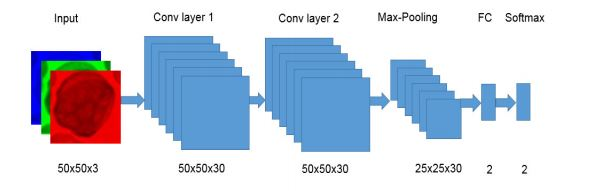
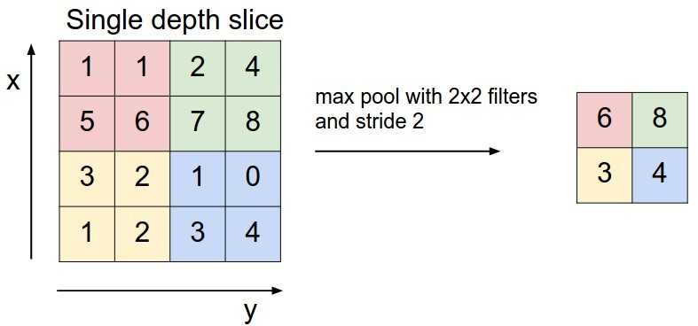
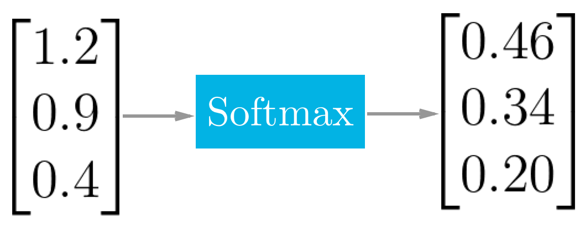

# Detecting Acute Lymphoblastic Leukemia Using Caffe*, OpenVINO™ and Intel® Neural Compute Stick 2
## Part 1: Introduction to convolutional neural networks in Caffe*
  
_IMAGE CREDIT: Anh Vo_

As part of my R&D for the Acute Myeloid/Lymphoblastic Leukemia (AML/ALL) AI Research Project, I am reviewing a selection of papers related to using Convolutional Neural Networks (CNN) for detecting AML/ALL. These papers share various ways of creating CNNs, and include useful information about the structure of the layers and the methods used which will help to reproduce the work outlined in the papers.

# Article Series
This is the first part of a series of articles that will take you through my experience building a custom classifier with Caffe* that should be able to detect Acute Lymphoblastic Leukemia (ALL). I chose Caffe as I enjoyed working with it in a previous project, and I liked the intuitivity of defining the layers using prototxt files, however my R&D will include replicating both the augmentation script and the classifier using different languages and frameworks to compare results.

Previously I had followed the Leukemia Blood Cell Image Classification Using Convolutional Neural Network paper by T. T. P. Thanh, Caleb Vununu, Sukhrob Atoev, Suk-Hwan Lee, and Ki-Ryong Kwon paper to create a simple data augmentation program that would match the methods carried out in the paper. This was my first time translating a research paper into code, and although the resulting code is fairly basic in this case (mostly a wrapper around OpenCV* functions), it was a cool experience.

# AML/ALL Classifiers Github Repo
Within the AML/ALL AI Research Project Github there is repository dedicated to open source classifiers, the [AML-ALL-Classifiers](https://github.com/AMLResearchProject/AML-ALL-Classifiers/blob/master/CONTRIBUTING.md "AML-ALL-Classifiers") repo, in this directory the team and GitHub developer community we hope to attract will share tutorials that use various languages, frameworks and technologies to create convolutional neural networks.

# Introduction to convolutional neural networks in Caffe*
In this technical article I will explain my experience of creating a custom convolutional neural network in Caffe using an architecture based on the [Acute Myeloid Leukemia Classification Using Convolution Neural Network In Clinical Decision Support System](https://airccj.org/CSCP/vol7/csit77505.pdf "Acute Myeloid Leukemia Classification Using Convolution Neural Network In Clinical Decision Support System") paper by Thanh.TTP, Giao N. Pham, Jin-Hyeok Park, Kwang-Seok Moon, Suk-Hwan Lee, and Ki-Ryong Kwon, and the [ALL_IDB1 dataset from Acute Lymphoblastic Leukemia Image Database for Image Processing](https://github.com/AMLResearchProject/AML-ALL-Classifiers/blob/master/CONTRIBUTING.md "ALL_IDB1 dataset from Acute Lymphoblastic Leukemia Image Database for Image Processing") dataset by Fabio Scotti, University of Milan.

In the augmentation paper, the authors mentioned that they were unable to reproduce a good accuracy using the augmented dataset, I will try to reproduce this and if I am unable to get good results will work on recreating the proposed architecture from the beginning of the augmentation paper.

“Our experiments were conducted on Matlab with 1188 images, 70% (831 images) of them for training and the remaining 30% (357 images) for testing our model. The slightly narrow architecture used dramatically failed to reach an appropriate accuracy when applied to this augmented dataset. Therefore, we have presented here a deeper CNN architecture and changed the size of the input volume in order to improve the accuracy rate of the recognition of leukemia (our proposed CNN model achieved 96.6%)”

__This tutorial can be found on the following platforms:__

- [Intel AI Developer Program Documentation](https://software.intel.com/en-us/articles/detecting-acute-lymphoblastic-leukemia-using-caffe-openvino-neural-compute-stick-2-part-1 "Intel AI Developer Program Documentation")
- [Linkedin Pulse](https://www.linkedin.com/pulse/detecting-acute-lymphoblastic-leukemia-using-caffe-2-milton-barker "Linkedin Pulse")

## Hardware:
•	UP2 Development board (can be other Linux device)
•	Neural Compute Stick 2 (Part of project can be run without)

# Operating System
- This project has been tested on Ubuntu 16.04
- This project has not been tested on any other operating systems

## Software:
•	Caffe
•	Intel OpenVino required if using NCS2

## Caffe Installation:
In my case I installed Caffe on an UP2, but as stated above this is not a requirement. During installation I ran into issues whilst following the Caffe Ubuntu 16.04 installation guide, which led me to find the following tutorial. To install on Ubuntu 16.04, follow this article which will take you through installing all required dependencies and installing PyCaffe. If you are installing on an UP2 or similar this may take some time.

  
_Figure 1. Caffe Installation_

Now that we have Caffe installed, I will explain a little bit about it. Caffe is another framework that we can use for building deep learning networks, including convolutional neural networks. I have used Caffe before with Neural Compute Stick (NCS) and YOLO for object detection, but have never really gone too deep into it the framework. 

## Proposed Architecture
  
_Figure 1. Proposed Architecture_  ([Source](https://airccj.org/CSCP/vol7/csit77505.pdf "Source"))

In [Acute Myeloid Leukemia Classification Using Convolution Neural Network In Clinical Decision Support System](https://airccj.org/CSCP/vol7/csit77505.pdf "Acute Myeloid Leukemia Classification Using Convolution Neural Network In Clinical Decision Support System") the authors explain the methods they used to define their convolutional neural network’s architecture. Through the use of prototxt files used by Caffe, we can easily, and fairly visually, set up our layers based on the information found in the paper. For more information about convolutions you can check out [Caffe’s convolutions page](https://airccj.org/CSCP/vol7/csit77505.pdf "Caffe’s convolutions page") or for a more in depth explanation you can check out the information in [CS231n: Convolutional Neural Networks for Visual Recognition](http://cs231n.stanford.edu/ "CS231n: Convolutional Neural Networks for Visual Recognition"). The remainder of this part of the article will focus on Caffe and the layers used in the paper, in the future I will cover convolutions in more detail.

As mentioned above, in the paper the authors share information about their architecture, they state how they use an architecture of using a 50 x 50 x 3 input layer (an image), 2 convolutional layers, a max pooling layer, a fully connected layer and softmax layer as an output.  The convolutional layers and the max pooling layers are used for feature detection, while the fully connected and softmax layers are used for feature classification.

### Input Layer
The input layer is what feeds data into the network, in our case we were using an image that is 257px x 257px x 3px so our input size would need to be 257 x 257 x 3 (Height, width, depth), for this project a new augmented dataset will be created using the dimensions specified in the paper. 

We can create a simple input layer using the following in a prototxt file: [allCNN.prototxt](https://www.linkedin.com/pulse/detecting-acute-lymphoblastic-leukemia-using-caffe-2-milton-barker-1f "allCNN.prototxt"), the additional dim, dim: 1, is the batch size meaning we will only send one image through the network per iteration, dim: 3/50/50 are the dimensions shown above which are the result of print(image.shape) (CV2). 

```
  layer {
    name: "data"
    type: "Input"
    input_param { shape: { dim: 1 dim: 3 dim: 50 dim: 50 }}
  }
```

## Feature Detection Layers
### Convolutional Layers
  
_Figure 2. Convolutional Layers_ ([Source](https://anhvnn.wordpress.com/2018/02/01/deep-learning-computer-vision-and-convolutional-neural-networks/ "Source"))

As mentioned in the paper, 2 convolution layers were used in the proposed architecture. The convolutional layers produce a feature map of a filter’s output activations. During convolution a filter is moved across the image and creates a new pixel in the output image.

We can define the layers as shown below. You will notice the bottom and top settings, these position  this layer below the data (input) layer and top is itself conv1, num_outputs is the number of filters, kernel_size represents the size of the filters, stride represents how many pixels the kernel will move by, pad is padding added to the input image (required if we increase the size of the filter larger than the image), engine specifies which engine the model will use (CAFFE/CUDNN),  weight_filler initializes the weights, we use the algorithm xavier which allows us to keep a stable signal, and finally bias_filter initializes the bias to 0, in the future I will cover more information about these parameters.

```
  layer {
    name: "conv1"
    type: "Convolution"
    convolution_param {
      num_output: 3
      kernel_size: 5.5
      stride: 1
      weight_filler {
        type: "Xavier"
      }
      bias_filler {
        type: "constant"
        value: 0
      }
    }
    bottom: "data"
    top: "conv2"
  }
```

### Pooling Layer
  
_Figure 3. Max Pooling Layer_ ([Source](https://cs231n.github.io/convolutional-networks/#pool "Source"))

The authors propose a pooling layer as the final layer in the feature extraction layers. Pooling layers help to reduce overfitting by reducing the size of the representation and the amount of activations/computation used by the network. 

The authors state they use a 25 x 25 layer with a filter size of 2 and using a stride of 2. We can define the pooling layer using the allCNN.prototxt file with the following:

```
layer {
  name: "pool1"
  type: "Pooling"
  pooling_param {
    pool: MAX
    kernel_size: 2
    stride: 2
  }
  bottom: "conv2"
  top: "fc"
}
```

## Feature Classification Layers
### Fully Connected Layer
  
_Figure 4. Fully Connected Layer_ ([Source](https://medium.com/@eternalzer0dayx/demystifying-convolutional-neural-networks-ca17bdc75559 "Source"))

The proposed architecture for feature classification includes a 2 x 2 fully connected or inner product layer. The name fully connected layers means the fc layers are fully connected to the activations of the layers they follow. Fully connected layers used with a softmax output layer are used to classify the input image using the trained classes. For more information about fully connected layers visit this link.
The authors state a fully connected layer with 2 neurons. We can recreate this layer using the following in the allCNN.prototxt file.

```
layer {
  name: "fc"
  type: "InnerProduct"
  inner_product_param {
    num_output: 2
    weight_filler {
      type: "xavier"
    }
    bias_filler {
      type: "constant"
      value: 0
    }
  }
  bottom: "pool"
  top: "fc"
}
```

### Softmax Layer
  
_Figure 5. Softmax Layer_ ([Source](https://towardsdatascience.com/deep-learning-concepts-part-1-ea0b14b234c8 "Source"))

The softmax layer proposed in the paper will output a probabilities distribution of an image being from each of the trained classes, each of the probabilities will add up to 1.0. For more information about softmax you can visit this link.

We can recreate the proposed softmax layer using allCNN.prototxt using the following: 

```
layer {
  name: "prob"
  type: "Softmax"
  bottom: "fc"
  top: "prob"
}
```

# Conclusion: 
In allCNN.prototxt we should now have the architecture proposed in the  Acute Myeloid Leukemia Classification Using Convolution Neural Network In Clinical Decision Support System paper, in the next part of the series I will cover using this architecture to train our model. 

Thanks to AML/ALL AI Research Project team members Amita Kapoor (Associate Professor @ Delhi University, New Dehli, India) and Ho Leung Ng (Kansas State University, Dept. Biochemistry & Molecular Biophysics) for their assistance with the article.

# Contributing
We welcome contributions of the project. Please read [CONTRIBUTING.md](https://github.com/AMLResearchProject/AML-ALL-Classifiers/blob/master/CONTRIBUTING.md "CONTRIBUTING.md") for details on our code of conduct, and the process for submitting pull requests.

# Versioning
We use SemVer for versioning. For the versions available, see [Releases](https://github.com/AMLResearchProject/AML-ALL-Classifiers/releases "Releases").

# License
This project is licensed under the **MIT License** - see the [LICENSE](https://github.com/AMLResearchProject/AML-ALL-Classifiers/blob/master/LICENSE "LICENSE") file for details.

# Bugs/Issues
We use the [repo issues](https://github.com/AMLResearchProject/AML-ALL-Classifiers/issues "repo issues") to track bugs and general requests related to using this project.  

# Project Author
Adam is a [BigFinite](https://www.bigfinite.com "BigFinite") IoT Network Engineer, part of the team that works on the core IoT software. In his spare time he is an [Intel Software Innovator](https://software.intel.com/en-us/intel-software-innovators/overview "Intel Software Innovator") in the fields of Internet of Things, Artificial Intelligence and Virtual Reality.

[](https://github.com/AdamMiltonBarker)