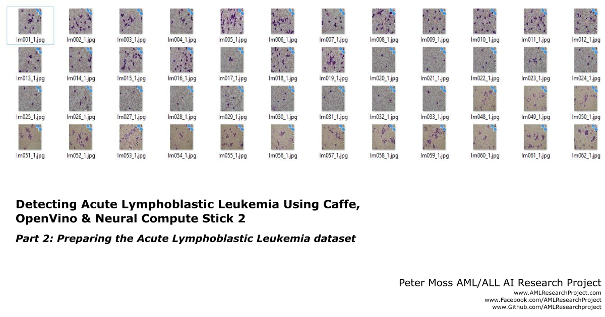
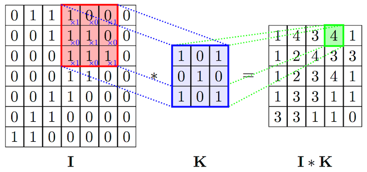
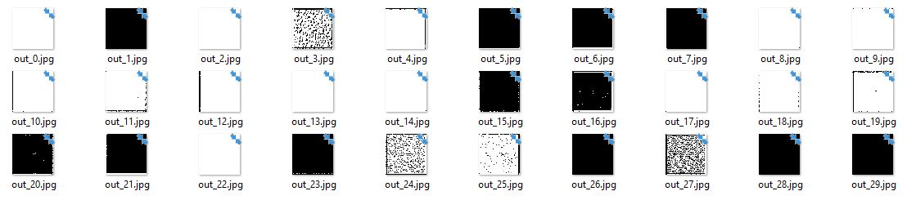

# Detecting Acute Lymphoblastic Leukemia Using Caffe*, OpenVINO™ and Intel® Neural Compute Stick 2
## Part 2: Preparing the Acute Lymphoblastic Leukemia dataset
  

In the first part of this series: [Introduction to convolutional neural networks in Caffe](https://github.com/AMLResearchProject/AML-ALL-Classifiers/blob/master/Python/_Caffe/allCNN/Caffe-Layers.md "Introduction to convolutional neural networks in Caffe"), I covered the steps to recreate the basics of the convolutional neural network proposed in the paper: [Acute Myeloid Leukemia Classification Using Convolution Neural Network In Clinical Decision Support System](https://airccj.org/CSCP/vol7/csit77505.pdf "Acute Myeloid Leukemia Classification Using Convolution Neural Network In Clinical Decision Support System").

  
In this article I will cover the steps required to create the dataset required to train the model using the network we defined in the previous tutorial. The article will cover the paper exactly, and will use the original 108 image dataset (ALL_IDB1).

A reminder that we use the [ALL_IDB1 dataset from Acute Lymphoblastic Leukemia Image Database for Image Processing](https://homes.di.unimi.it/scotti/all/ "ALL_IDB1 dataset from Acute Lymphoblastic Leukemia Image Database for Image Processing") dataset, to use this dataset you must request access by visiting [this page](https://homes.di.unimi.it/scotti/all/#download "this page").

# Article Series
This is the second part of a series of articles that will take you through my experience building a custom classifier with Caffe* that should be able to detect Acute Lymphoblastic Leukemia (ALL). I chose Caffe as I enjoyed working with it in a previous project, and I liked the intuitivity of defining the layers using prototxt files, however my R&D will include replicating both the augmentation script and the classifier using different languages and frameworks to compare results.

# Compatibility
This project has so far only been testing on Ubuntu 16.04

# Refresher
Before we begin, we can do some more visualization for the network we created in the previous article. We cloned the [AML-ALL-Classifiers](https://github.com/AMLResearchProject/AML-ALL-Classifiers/ "AML-ALL-Classifiers") repository and should have run the Setup.sh script in the allCNN project directory root. There have been some updates to the files in this repository so you should make sure you have the latest files. We can use the following command to view information about the network:

```
python3.5 Info.py NetworkInfo
```

We can save the network using:

```
python3.5 Info.py Save
```

## Additional visualization
We can also do some more visualization, using the following command we can loop through all of the 30 neurons in the conv1 and conv2 layers, saving the images inside the neurons to disk. Running the following command will write the output images to the Model/Output directory (conv1 & conv2).

```
python3.5 Info.py Outputs
```

### Conv1 output images
  
Figure 1. conv1 layer neuron output images

### Conv2 output images
  
Figure 2. conv2 layer neuron output images

# Preparing the Acute Lymphoblastic Leukemia dataset
The first thing we need to do is to sort our training and validation data. In the paper the authors state that they used the full 108 image dataset, ALL_IDB1. The paper shows that a training dataset of 80 images was used, and a validation dataset of 28. First of all we need to resize the dataset to 50px x 50px to match the input dimensions of our network, this process is handled by the functions provided in CaffeHelpers.py.

## Sorting the data
This article introduces two additional scripts in the allCNN project, [Data.py](https://github.com/AMLResearchProject/AML-ALL-Classifiers/blob/master/Python/_Caffe/allCNN/Data.py "Data.py") & [Classes/CaffeHelpers.py](https://github.com/AMLResearchProject/AML-ALL-Classifiers/blob/master/Python/_Caffe/allCNN/Classes/CaffeHelpers.py "Classes/CaffeHelpers.py"). These files will help us sort our data into training and validation sets, and create the LMDB databases required by Caffe.

## LMDB 
[LMDB](https://en.wikipedia.org/wiki/Lightning_Memory-Mapped_Database "LMDB") or Lightning Mapped Database is used by Caffe to store our training/validation data and labels. In the [Classes/CaffeHelpers.py](https://github.com/AMLResearchProject/AML-ALL-Classifiers/blob/master/Python/_Caffe/allCNN/Classes/CaffeHelpers.py "Classes/CaffeHelpers.py") file you will find a few functions that will help you convert your dataset into an LMDB database. [Data.py](https://github.com/AMLResearchProject/AML-ALL-Classifiers/blob/master/Python/_Caffe/allCNN/Data.py "Data.py") is basically a wrapper around these functions which will do everything you need to do to create your LMDBs.

## Sort ALL_IDB1
First of all, you need to upload the ALL_IDB1 dataset to the [Model/Data/Train/0](https://github.com/AMLResearchProject/AML-ALL-Classifiers/tree/master/Python/_Caffe/allCNN/Model/Data/Train/0 "Model/Data/Train/0") and [Model/Data/Train/1](https://github.com/AMLResearchProject/AML-ALL-Classifiers/tree/master/Python/_Caffe/allCNN/Model/Data/Train/1 "Model/Data/Train/1") directories, to do this you can take the positive images from ALL_IDB1 (ending in _1.jpg) and add to the Model/Data/Train/1 directory, then do the same for the negative images (ending in _0.jpg).

## Proposed Training / Testing Sets
The training and validation sets proposed in the paper are as follows:

  
Figure 3. Training / testing data from paper ([Source](https://airccj.org/CSCP/vol7/csit77505.pdf "Source"))

## Recreating Proposed Training / Testing Sets  
  
Figure 4. Training/validation data sorting output

In this article we are wanting to replicate the training and validation dataset sizes used in the paper. To ensure we get the correct training and validation sizes we use helper classes that I wrote that are provided in the Classes directory.

A reminder that we use the [ALL_IDB1 dataset from Acute Lymphoblastic Leukemia Image Database for Image Processing](https://homes.di.unimi.it/scotti/all/ "ALL_IDB1 dataset from Acute Lymphoblastic Leukemia Image Database for Image Processing") dataset, to use this dataset you must request access by visiting [this page](https://homes.di.unimi.it/scotti/all/#download "this page").

# Detecting Acute Lymphoblastic Leukemia Using Caffe, OpenVino & Neural Compute Stick Series
- [Introduction to convolutional neural networks in Caffe](https://software.intel.com/en-us/articles/detecting-acute-lymphoblastic-leukemia-using-caffe-openvino-neural-compute-stick-2-part-1 "Introduction to convolutional neural networks in Caffe")  
- [Preparing the Acute Lymphoblastic Leukemia dataset](https://www.linkedin.com/pulse/detecting-acute-lymphoblastic-leukemia-using-caffe-2-milton-barker-1f "Preparing the Acute Lymphoblastic Leukemia dataset")  
- [Github Project](https://github.com/AMLResearchProject/AML-ALL-Classifiers/tree/master/Python/_Caffe/allCNN "Github Project")  

# Contributing
We welcome contributions of the project. Please read [CONTRIBUTING.md](https://github.com/AMLResearchProject/AML-ALL-Classifiers/blob/master/CONTRIBUTING.md "CONTRIBUTING.md") for details on our code of conduct, and the process for submitting pull requests.

# Versioning
We use SemVer for versioning. For the versions available, see [Releases](https://github.com/AMLResearchProject/AML-ALL-Classifiers/releases "Releases").

# License
This project is licensed under the **MIT License** - see the [LICENSE](https://github.com/AMLResearchProject/AML-ALL-Classifiers/blob/master/LICENSE "LICENSE") file for details.

# Bugs/Issues
We use the [repo issues](https://github.com/AMLResearchProject/AML-ALL-Classifiers/issues "repo issues") to track bugs and general requests related to using this project.  

# Project Author
Adam is a [BigFinite](https://www.bigfinite.com "BigFinite") IoT Network Engineer, part of the team that works on the core IoT software. In his spare time he is an [Intel Software Innovator](https://software.intel.com/en-us/intel-software-innovators/overview "Intel Software Innovator") in the fields of Internet of Things, Artificial Intelligence and Virtual Reality.

[](https://github.com/AdamMiltonBarker)