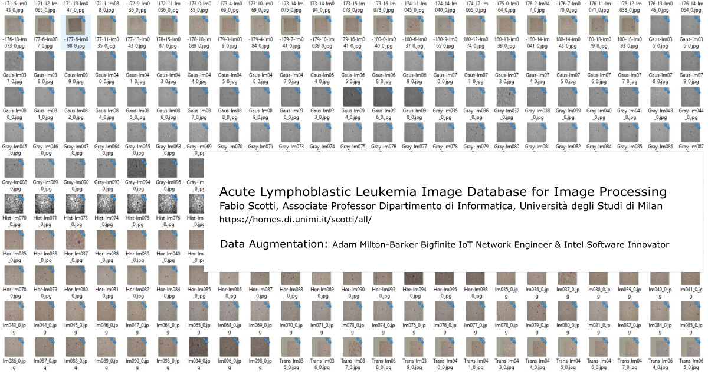
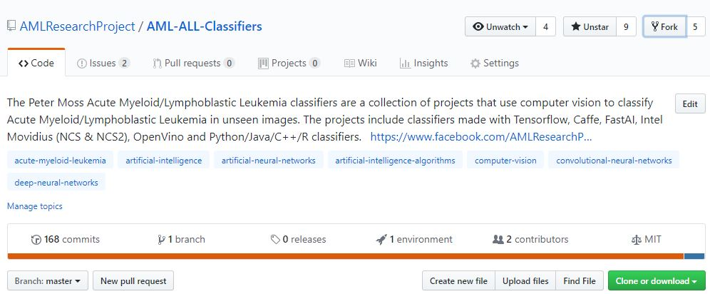

# Acute Myeloid/Lymphoblastic Leukemia Classifiers

The Peter Moss Acute Myeloid/Lymphoblastic Leukemia classifiers are a collection of projects that use computer vision to classify Acute Myeloid/Lymphoblastic Leukemia in unseen images. The projects include classifiers made with Tensorflow, Caffe, Intel Movidius (NCS & NCS2), OpenVino and pure Python classifiers. 

# Data Augmentation

The [Acute Myeloid/Lymphoblastic Leukemia Classifier Data Augmentation program](https://github.com/AMLResearchProject/AML-ALL-Classifiers/tree/master/Python/Augmentation "Acute Myeloid/Lymphoblastic Leukemia Classifier Data Augmentation program") applies filters to datasets and increases the amount of training / test data.

# Python Classifiers
This repository hosts a collection of classifiers that have been developed by the team using the Python programming language.  These classifiers include Caffe, FastAI, Movidius, OpenVino, pure Python and Tensorflow classifiers. 

| Project  | Description | Status |
| ------------- | ------------- |  ------------- | 
| [Caffe](https://github.com/AMLResearchProject/AML-ALL-Classifiers/tree/master/Python/_Caffe/ "Caffe") | AML/ALL classifiers created using the Caffe framework. | Development | 
| [FastAI](https://github.com/AMLResearchProject/AML-ALL-Classifiers/tree/master/Python/_FastAI/ "FastAI") | AML/ALL classifiers created using the FastAI framework. | Development | 
| [Movidius](https://github.com/AMLResearchProject/AML-ALL-Classifiers/tree/master/Python/_Movidius/ "Movidius") | AML/ALL classifiers created using Intel Movidius. | Development | 
| [OpenVino](https://github.com/AMLResearchProject/AML-ALL-Classifiers/tree/master/Python/_OpenVino/ "OpenVino") | AML/ALL classifiers created using Intel OpenVino. | Development | 
| [Pure Python](https://github.com/AMLResearchProject/AML-ALL-Classifiers/tree/master/Python/_Pure/ "Pure Python") | AML/ALL classifiers created using pure Python. | Development |
| [Tensorflow](https://github.com/AMLResearchProject/AML-ALL-Classifiers/tree/master/Python/_Tensorflow/ "Tensorflow") | AML/ALL classifiers created using the Tensorflow framework. | Development | 

## Intel Movidius/NCS Python Classifiers
This repository hosts a collection of classifiers that have been developed by the team using Python and Intel NCS/NCS2. 

| Project | Description | Status |
| ------------- | ------------- |  ------------- | 
| [Movidius NCS](https://github.com/AMLResearchProject/AML-ALL-Classifiers/tree/master/Python/_Movidius/NCS/ "Movidius NCS") | AML/ALL classifiers created using Intel Movidius NCS. | Redevelopment |
| [Movidius NCS2](https://github.com/AMLResearchProject/AML-ALL-Classifiers/tree/master/Python/_Movidius/NCS2/ "Movidius NCS2") | AML/ALL classifiers created using Intel Movidius NCS2 & OpenVino. | Development |

## FastAI Python Classifiers
This repository hosts a collection of classifiers that have been developed by the team using Google Colabs and FastAI. 

| Model  | Project  | Description | Status | Author | 
| -------------  |  ------------- | ------------- | ------------- | ------------- |
| Resnet  | [FastAI Resnet50 Classifier](https://github.com/AMLResearchProject/AML-ALL-Classifiers/tree/master/Python/_FastAI/Resnet50/ALL-FastAI-Resnet-50.ipynb "FastAI Resnet50 Classifier") | A FastAI model trained using Resnet50 |  Development | [Salvatore Raieli](https://github.com/salvatorera "Salvatore Raieli") | 
| Resnet | [FastAI Resnet50(a) Classifier](https://github.com/AMLResearchProject/AML-ALL-Classifiers/tree/master/Python/_FastAI/Resnet50/ALL-FastAI-Resnet-50-a.ipynb "FastAI Resnet50(a) Classifier") | A FastAI model trained using Resnet50 |  Development | [Adam Milton-Barker](https://github.com/AdamMiltonBarker "Adam Milton-Barker") | 
| Resnet | [FastAI Resnet34 Classifier](https://github.com/AMLResearchProject/AML-ALL-Classifiers/tree/master/Python/_FastAI/Resnet34 "FastAI Resnet34 Classifier") | A FastAI model trained using Resnet34 |  Development | [Salvatore Raieli](https://github.com/salvatorera "Salvatore Raieli") | 
| Resnet | [FastAI Resnet18 Classifier](https://github.com/AMLResearchProject/AML-ALL-Classifiers/blob/master/Python/_FastAI/Resnet18/ALL_FastAI_Resnet_18.ipynb "FastAI Resnet18 Classifier") | A FastAI model trained using Resnet18 |  Development | [Adam Milton-Barker](https://github.com/AdamMiltonBarker "Adam Milton-Barker") | 

## Detecting Acute Lymphoblastic Leukemia Using Caffe, OpenVino & Neural Compute Stick Series 
A series of articles / tutorials by [Adam Milton-Barker](https://github.com/AdamMiltonBarker "Adam Milton-Barker") that take you through attempting to replicate the work carried out in the [Acute Myeloid Leukemia Classification Using Convolution Neural Network In Clinical Decision Support System](https://airccj.org/CSCP/vol7/csit77505.pdf "Acute Myeloid Leukemia Classification Using Convolution Neural Network In Clinical Decision Support System") paper.

- [Introduction to convolutional neural networks in Caffe*](https://github.com/AMLResearchProject/AML-ALL-Classifiers/blob/master/Python/_Caffe/allCNN/Caffe-Layers.md "Introduction to convolutional neural networks in Caffe*")
- [Preparing the Acute Lymphoblastic Leukemia dataset](https://github.com/AMLResearchProject/AML-ALL-Classifiers/blob/master/Python/_Caffe/allCNN/Data-Sorting.md "Preparing the Acute Lymphoblastic Leukemia dataset")

# Contributing

The Peter Moss Acute Myeloid/Lymphoblastic Leukemia AI Research project encourages and welcomes code contributions, bug fixes and enhancements from the community to the Github repositories. Please read the [CONTRIBUTING](https://github.com/AMLResearchProject/AML-ALL-Classifiers/blob/master/CONTRIBUTING.md "CONTRIBUTING") document for a full guide to forking our repositories and submitting your pull request. You will also find on our code of conduct.

# Versioning
We use SemVer for versioning. For the versions available, see [Releases](https://github.com/AMLResearchProject/AML-ALL-Classifiers/releases "Releases").

# License
This project is licensed under the **MIT License** - see the [LICENSE](https://github.com/AMLResearchProject/AML-ALL-Classifiers/blob/master/LICENSE "LICENSE") file for details.

# Bugs/Issues
We use the [repo issues](https://github.com/AMLResearchProject/AML-ALL-Classifiers/issues "repo issues") to track bugs and general requests related to using this project.  

# Repository Manager
Adam is a [BigFinite](https://www.bigfinite.com "BigFinite") IoT Network Engineer, part of the team that works on the core IoT software. In his spare time he is an [Intel Software Innovator](https://software.intel.com/en-us/intel-software-innovators/overview "Intel Software Innovator") in the fields of Internet of Things, Artificial Intelligence and Virtual Reality.

